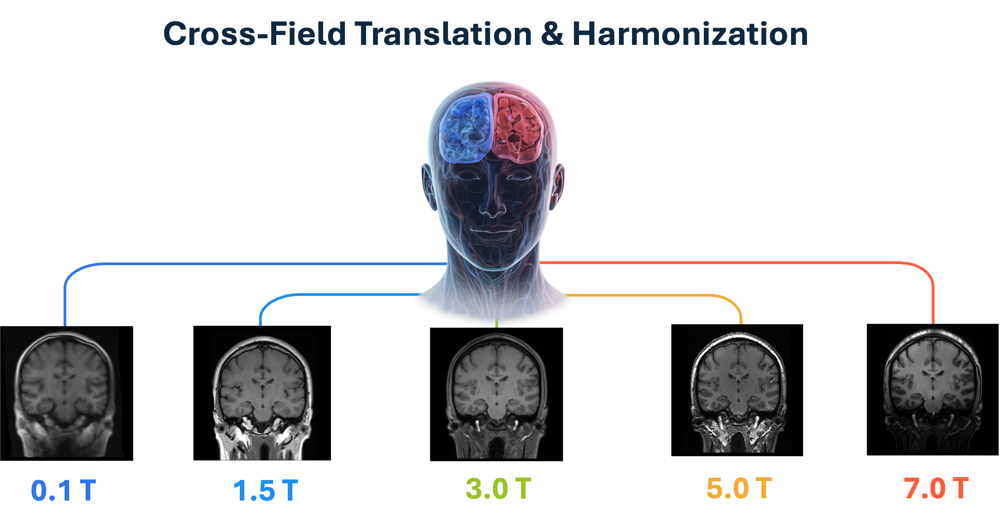
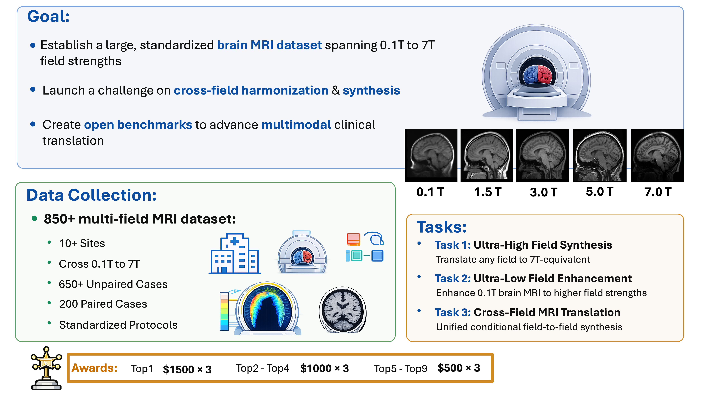

## Image Gallery

## About Us

#### Welcome to the Generalizable Cross-Field MRI Translation and Harmonization Challenge (MRIxFields2026)

—an integral part of the 29th International Conference on Medical Image Computing and Computer Assisted Intervention (MICCAI 2026), hosted in Abu Dhabi, United Arab Emirates, from October 4th to 8th, 2026. 

LEARN MORE (MICCAI 2026 - 29. International Conference On Medical Image Computing & Computer Assisted Intervention)

**🧠 MRIxFields2026: Cross-Field MRI Translation and Harmonization**

> Our Vision: To bridge ultra-low-field accessibility and ultra-high-field image quality within a single benchmark. By leveraging AI to encode and manipulate field-dependent imaging characteristics, we aim to catalyze the development of scalable, field-aware MRI synthesis methods to support reliable multi-center neuroscience research and the real-world clinical deployment of low-field MRI systems.

**🌟 What is Cross-Field MRI Harmonization? (Beyond Hardware: A Unified View of the Brain)**

Imagine taking a brain MRI from any hospital—whether on a portable, low-cost scanner or a high-end research machine—and instantly transforming it into a standardized, high-quality image. This is Cross-Field MRI Harmonization—breaking the physical limits of MRI scanners.

- **The Multi-Field Challenge**: Scanners range from ultra-low (0.1T) to ultra-high (7T) fields, creating massive variations in noise, resolution, homogeneity and contrast. These differences severely limit data comparability across different hospitals.
- **Beyond Hardware Limits**: Using advanced generative AI, we can 	computationally reconstruct 7T-equivalent high-field images from arbitrary scanners , and restore crucial tissue contrast from severely degraded 0.1T ultra-low-field scans.

- **Pivotal Clinical Value**: This technology enables seamless dataset harmonization for large-scale, multi-center neuroscience research. Crucially, it brings reliable, high-quality diagnostic imaging to low-resource and point-of-care settings without the need for expensive hardware.

 

  

**🎯 Why This Challenge? (Pain Points & Opportunities)**

While MRI is a central tool for neuroscience research and clinical assessment, the vast diversity in scanning hardware creates significant, long-standing barriers for large-scale data integration.

- **The Clinical Pain Point: Field-Dependent Heterogeneity:** The rapidly expanding spectrum of MRI scanners (from 0.1T to 7T) introduces substantial heterogeneity in signal-to-noise ratio, contrast behavior, and spatial resolution. These differences fundamentally limit data comparability across hospitals and pose a major barrier to the clinical translation of AI-based MRI models.

- **The Technological Bottleneck: Narrow-Domain Limits:** Existing datasets and challenges are typically confined to narrow field ranges or single-domain settings. Because of this, conventional pipelines and current generative models often fail to generalize across realistic multi-field scenarios or struggle with severely degraded ultra-low-field acquisitions.

- **The Unique Opportunity of Multi-Field Datasets:** This challenge introduces the first publicly available MRI benchmark that systematically covers the entire clinically relevant magnetic field spectrum. By providing prospectively acquired cross-field paired scans, it offers a rare and rigorous foundation for directly evaluating anatomical consistency and cross-domain generalization.

- **The AI Opportunity: Breaking Hardware Barriers:** We seek innovative data-driven approaches capable of bridging these physical hardware gaps. Generative models have the potential to infer high-field-equivalent anatomical structures from low-field inputs , enabling uniform structural analysis and restoring diagnostic reliability without expensive hardware.

**The Core Goal:** MRIxFields2026 provides a rigorous testbed for assessing robustness, generalizability, and anatomical fidelity of generative models in heterogeneous multi-field MRI environments. By bridging ultra-low-field accessibility and ultra-high-field image quality within a single benchmark, we aim to catalyze scalable, field-aware MRI synthesis methods for real-world clinical deployment.

## MRIxFields2026 Challenge Overview

| Module | Description |
|---|---|
| Challenge Name | MRIxFields2026: A Generalizable Cross-Field MRI Translation and Harmonization Challenge |
| Field Strengths | 0.1T, 1.5T, 3T, 5T, 7T |
| Imaging Modality | Structural MRI |
| Sequences / Contrasts | 3D T1-weighted, 2D/3D T2-weighted, 2D/3D T2-FLAIR |
| Data Composition | Unpaired multi-field cohorts + travelling-volunteer paired cross-field cohort |
| Total Cases | 850+ cases for each modality (T1W, T2W and T2-Flair) |
| Unpaired Cohort | 650+ cases (across 5 field strengths for each modality) |
| Paired Cohort | 200 cases (40 volunteers × 5 field strengths for each modality) |
| Training Set | 700 cases+ (unpaired cohort + 10 paired subjects × 5 field strengths) |
| Validation Set | 50 cases (10 volunteers × 5 field strengths) |
| Test Set | 100 cases (20 held-out volunteers × 5 field strengths) |
| Case Definition | One case is defined as a complete scan of a single subject acquired on one MRI system at a specific field strength |
| Paired Information | The travelling-volunteer cohort consists of the same subjects scanned across all five field strengths |
| Primary Applications | Cross-field MRI synthesis, ultra-low-field enhancement, controllable field-to-field translation |
| Evaluation Reference | Ground-truth images at the target/high field strength from the paired cohort |
| Evaluation Metrics | nRMSE, SSIM, LPIPS, Dice, normalized volume consistency |
| Scanners | 0.1T: piMR-820H; 1.5T: uMR 670; 3T: MAGNETOM Prisma; 5T: uMR Jupiter; 7T: MAGNETOM Terra |

To bridge the gap between heterogeneous clinical acquisitions and high-fidelity neuroscience research, the MRIxFields2026 challenge utilizes about 850 cases spanning 5 magnetic field strengths (0.1T to 7T) to evaluate generative models across three specific tasks:

1. **Task 1: Ultra-High Field MRI Synthesis from Arbitrary Magnetic Field Strengths** – Targets the generation of high-field-equivalent MRI from arbitrary input field strengths, enabling models to recover fine anatomical details and quantitative properties associated with 7T imaging.
2. **Task 2: Higher-Field MRI Generation from Ultra-Low Magnetic Field Strengths** – Addresses a rapidly emerging global priority: enhancing 0.1T ultra-low-field MRI to restore clinically meaningful tissue contrast under severely degraded imaging conditions.
3. **Task 3: Controllable Field-to-Field MRI Synthesis with a Unified Conditional Model** – Introduces controllable, generalizable field-to-field synthesis via explicit conditioning mechanisms. This is crucial for harmonizing datasets across hospitals, reducing domain shift, and supporting large-scale clinical AI deployment.

## Awards
Each task will have 1 First Prize, 3 Second Prize and 5 Third Prize. We are actively finalizing the details with our sponsors, with a total prize pool of approximately **$9000**.

  

All valid submissions will be reported in the public leaderboard. Prize-winning methods will be announced publicly as part of a scientific session at the MICCAI 2026 annual meeting. Participating teams with a valid submission can nominate their team members as co-authors for the final challenge summary paper.

## Timeline
The schedule of the challenge is as follows. All deadlines are Pacific Standard Time (PST +11:59).

  

    <strong>[Apr. 01, 2026]</strong> Website opens for registration
  

  

    <strong>[Apr. 10, 2026]</strong> Release training data and validation data
  

  

    <strong>[May. 10, 2026]</strong> Submission system opens for validation
  

  

    <strong>[July. 01, 2026]</strong> Submission system opens for testing
  

  

    <strong>[Sept. 10, 2026]</strong> Registration and docker submission deadline
  

  

    <strong>[Oct. 08, 2026]</strong> Release final results during the MICCAI annual meeting
  

--------------------------------

  

